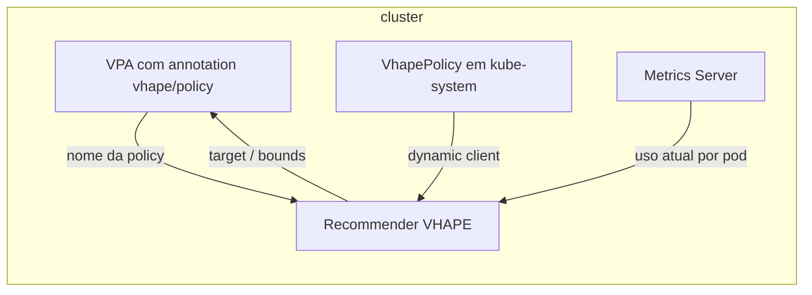

# VHAPE — Vertical Heuristic Autoscaling Policy Engine

Documentação do fork/evolução do recomendador do [Vertical Pod Autoscaler](https://github.com/kubernetes/autoscaler/tree/master/vertical-pod-autoscaler) (VPA) com políticas configuráveis por workload via CRD, em vez do histograma fixo do upstream.

**Grupo API:** `autoscaling.vhape.io/v1alpha1` · **Recurso:** `VhapePolicy` (`vhapepolicies`)

---

## Índice

1. [Motivação](#motivação)
2. [Visão geral](#visão-geral)
3. [Como usar](#como-usar)
4. [Especificação `VhapePolicy`](#especificação-vhapepolicy)
5. [Heurísticas](#heurísticas)
6. [Scaling rules](#scaling-rules)
7. [Comportamento técnico](#comportamento-técnico)
8. [Evolução do projeto](#evolução-do-projeto)
9. [Arquivos principais](#arquivos-principais)

---

## Motivação

O recomendador padrão do VPA usa um histograma exponencial decaído para estimar uso. Na prática isso traz limitações:

| Limitação | Efeito |
|-----------|--------|
| Heurística fixa | Não dá para ajustar percentil, histerese ou bounds por workload sem mudar código |
| Política acoplada ao modelo | Difícil separar “como estimar” de “quando aceitar subir ou descer” |
| Janela implícita no decaimento | Sem controle explícito do horizonte de amostras |
| Agregação multi-réplica | Picos de réplicas diferentes tendem a inflar a recomendação |
| Direção de escala | Não há knob para “só reduzir” ou “só aumentar” sem fork do core |

O VHAPE endereça isso com um CRD (`VhapePolicy`), heurística baseada em janela deslizante + histerese, e regras opcionais de direção de escala.

---

## Visão geral



1. **`VhapePolicy`** — define heurística, percentis, histerese, bounds e scaling rule.
2. **`percentile-hysteresis`** — janela de 24h com amostras horodatadas; percentil configurável; histerese evita oscilação.
3. **`ScalingRule`** — opcional; filtra recomendações que vão na direção “errada” conforme a política.

---

## Como usar

### Pré-requisitos

- Cluster com **Metrics Server** (o recomendador lê uso atual dos containers por pod).
- CRD, RBAC e policies aplicados em **`kube-system`** (os manifests estão em `yamls/`).
- Imagem/binário do **recommender** compilado com o código VHAPE (não basta o VPA upstream).

### Passos

1. Aplicar `vhapepolicy-crd.yaml`, depois `vhapepolicy-rbac.yaml` e as policies desejadas (`vhapepolicy-default.yaml`, `vhapepolicy-krr.yaml`, etc.).
2. No **VerticalPodAutoscaler** do workload, definir a annotation com o **nome** do objeto `VhapePolicy` em `kube-system`:

```yaml
metadata:
  annotations:
    vhape/policy: "default"   # ou "krr", conforme o metadata.name da policy
```

3. Garantir que o recommender use cliente dinâmico com permissão de `get` em `vhapepolicies` no namespace `kube-system`.

### Comportamento se a policy falhar

Se a annotation `vhape/policy` estiver ausente, se o nome não existir em `kube-system`, ou se o `spec` for inválido, o recomendador **registra aviso e devolve recomendação vazia** para esse VPA nesse ciclo (não há fallback silencioso para o histograma upstream nesse caminho).

---

## Especificação `VhapePolicy`

Objetos **`VhapePolicy`** devem residir no namespace **`kube-system`**. O valor de `metadata.name` é o que você referencia na annotation do VPA.

| Campo | Tipo | Descrição |
|-------|------|-----------|
| `spec.heuristic` | string | Nome da heurística (ver [Heurísticas](#heurísticas)). |
| `spec.cpu` / `spec.memory` | objeto | `percentile`, `headroom`, `lowerBound`, `upperBound` (0–1 em fração, exceto percentil que pode ser 1.0 para P100 na memória). |
| `spec.scalingRule` | string | Opcional: `scale-down-only`, `scale-up-only`, ou `""` para sem restrição. |

**Semântica dos campos por recurso**

- **`percentile`** — percentil calculado sobre as amostras dentro da janela (ex.: `0.93` = P93, `1.0` = máximo observado).
- **`headroom`** — banda de **histerese**: o target só é recalculado de forma relevante quando o novo percentil sai da faixa em torno da recomendação anterior (evita flapping).
- **`lowerBound` / `upperBound`** — afastamento **multiplicativo** do target para preencher `lowerBound` e `upperBound` do objeto de recomendação do VPA (`target × (1 - lowerBound)`, `target × (1 + upperBound)`).

---

## Heurísticas

| Valor em `spec.heuristic` | Comportamento |
|---------------------------|----------------|
| `percentile-hysteresis` | Implementação atual: estimadores de CPU e memória com janela deslizante de **24h** e histerese (`logic/heuristics/hysteresis.go`). |
| `p95-max-memory` | Reservado para perfil estilo KRR; **hoje** o código ainda usa os mesmos estimadores de histerese com os percentis do `spec` (ver TODO em `logic/estimator.go`). Útil como nome semântico em YAML (ex.: `vhapepolicy-krr.yaml`). |

Fluxo por ciclo (heurística ativa):

1. Inserir amostras de uso de **cada pod** do workload com timestamp.
2. Remover amostras mais antigas que 24h.
3. Calcular o percentil configurado sobre o que restou.
4. Aplicar histerese em relação à recomendação anterior.

---

## Scaling rules

Implementações em `logic/scaling_rules/`; nomes **exatos** em `spec.scalingRule`:

| Valor | Efeito |
|-------|--------|
| `scale-down-only` | Ignora ajustes que **aumentam** CPU/memória em relação ao recurso atual. |
| `scale-up-only` | Ignora ajustes que **diminuem** CPU/memória. |
| `""` (vazio) | Aceita qualquer direção. |

---

## Comportamento técnico

- **Fonte de amostras:** uso atual dos containers via integração com métricas (equivalente ao fluxo do metrics-server no deployment típico).
- **Multi-réplica:** a interface dos estimadores recebe `[]float64` (um valor por pod), em vez de um único escalar agregado, reduzindo a inflação por pico isolado de uma réplica.
- **Persistência:** estimadores são criados uma vez por chave de policy e reutilizados entre ciclos (`getOrCreateEstimators` em `logic/recommender.go`), preservando `prevOpt` e a janela de amostras.
- **Observabilidade:** logs com `klog.V(4)` e `V(5)` para amostras, purge e GC de chaves órfãs; separador visual entre ciclos no `RunOnce`.

---

## Evolução do projeto

| Fase | Tema |
|------|------|
| 1 | Framework base: CRD, histerese, scaling rules, orquestração em `recommender.go`, manifests. |
| 2 | Estimadores persistidos entre ciclos (correção de estado de histerese). |
| 3 | RBAC para leitura de `VhapePolicy`. |
| 4 | Janela deslizante real (`TimedSample`), amostras por pod. |
| 5 | Logs estruturados e delimitação de ciclos. |
| 6 | Renomeação `p93-hysteresis` → `percentile-hysteresis`. |
| 7 | `lowerBound` / `upperBound` separados de `headroom`. |

---

## Arquivos principais

| Caminho | Função |
|---------|--------|
| `logic/vhape_policy.go` | GVR do CRD, `FetchVhapePolicy`, parsing do `spec`. |
| `logic/estimator.go` | Registro de heurísticas, `selectHeuristic`. |
| `logic/heuristics/hysteresis.go` | Estimadores CPU/memória, janela 24h, percentil e histerese. |
| `logic/scaling_rule.go` | `ScalingRule` e `selectScalingRule`. |
| `logic/scaling_rules/scaleup_only.go` | Regra só escala para cima. |
| `logic/scaling_rules/scaledown_only.go` | Regra só escala para baixo. |
| `logic/types/types.go` | Tipos compartilhados (evita ciclo de import). |
| `yamls/vhapepolicy-crd.yaml` | CRD. |
| `yamls/vhapepolicy-rbac.yaml` | Permissões do recommender. |
| `yamls/vhapepolicy-default.yaml` | Policy de exemplo / padrão de valores. |
| `yamls/vhapepolicy-krr.yaml` | Policy inspirada em perfil KRR (P95 CPU, P100 memória). |
| `yamls/recommender_manifest.yaml` | Manifest do recommender customizado. |
| `yamls/recommender_deployment.yaml` | Deployment de exemplo. |

Para detalhes dos comentários inline dos manifests, abra os YAMLs em `yamls/`.
